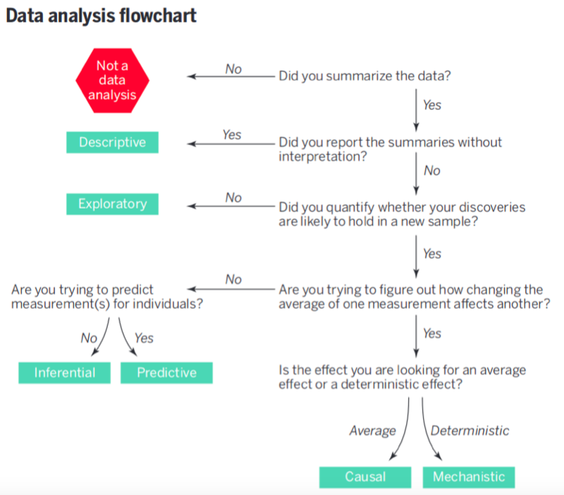
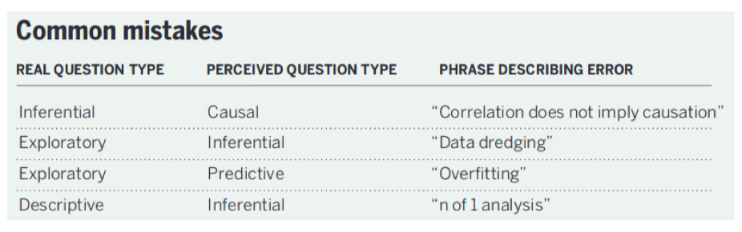
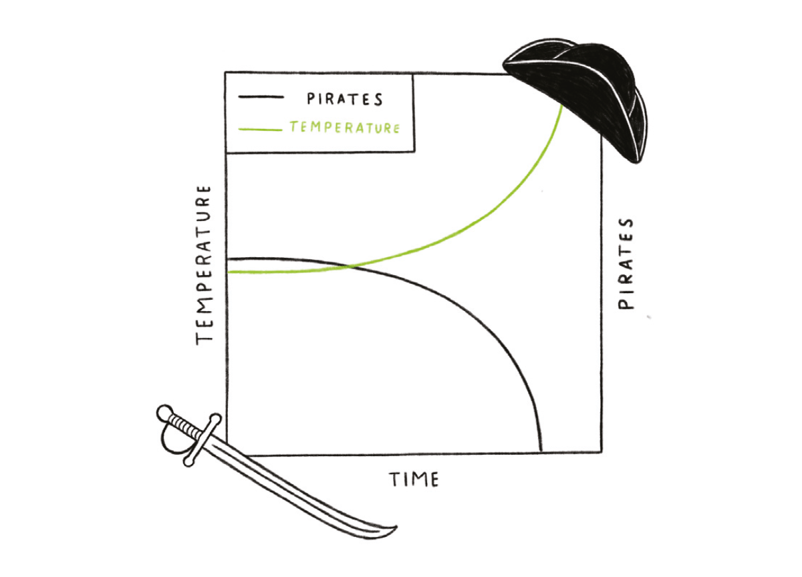
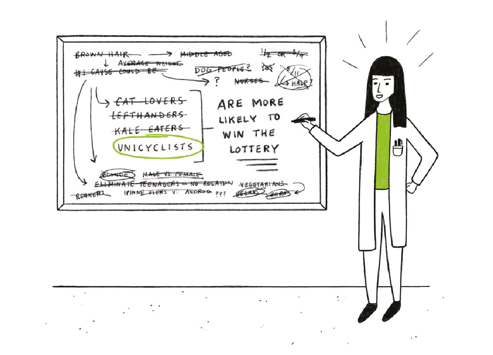
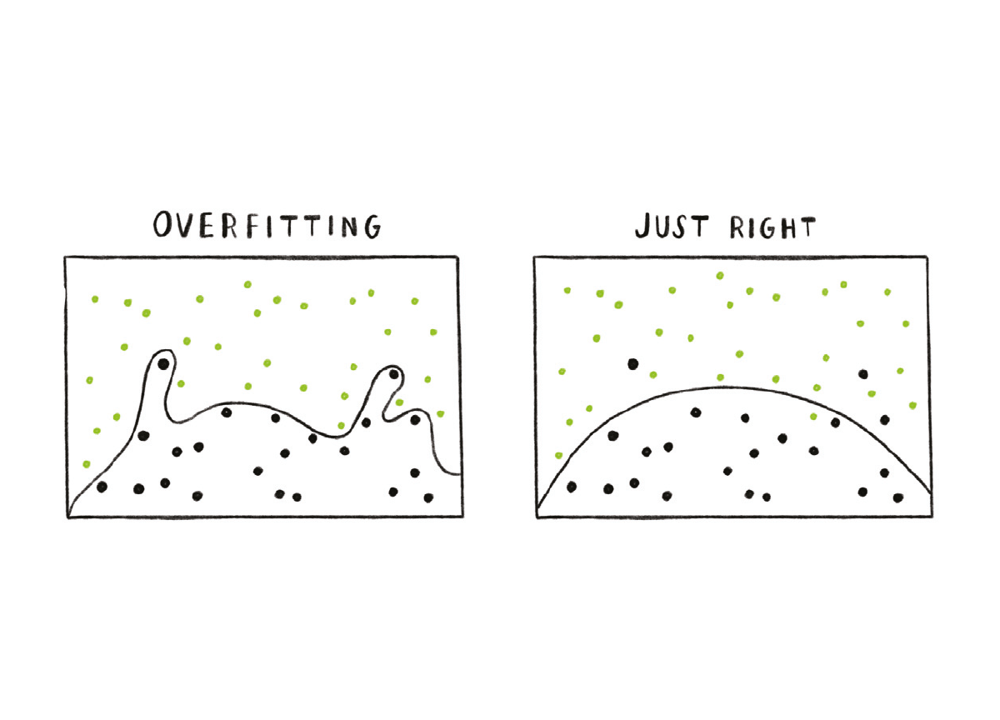
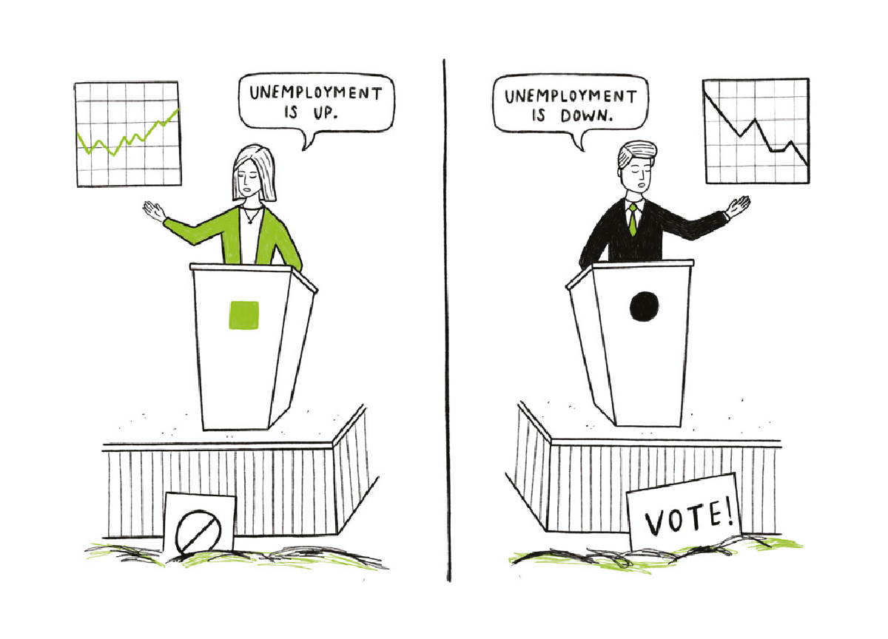
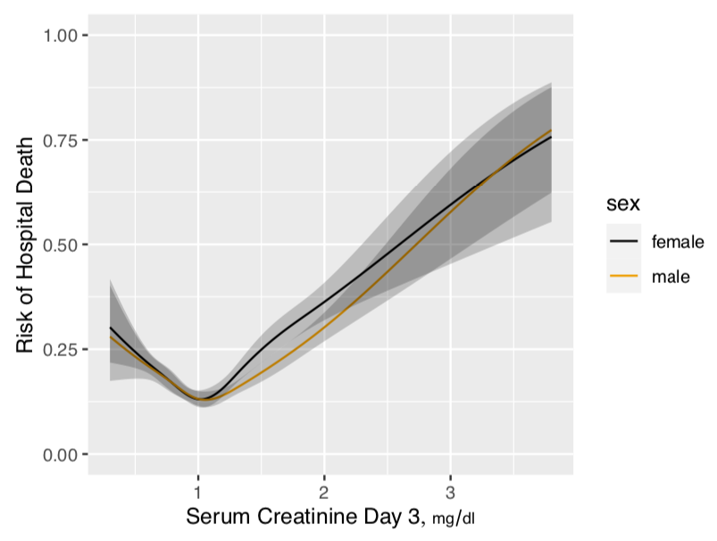

```{r xaringan-themer, include = FALSE}
library(xaringanthemer)
style_mono_accent(
  base_color = "#275A53", #myrtle green
  # base_color = "#6A63DD",
  # base_color = "#FFA3AF",
  header_font_google = google_font("Josefin Sans"),
  text_font_google   = google_font("Montserrat", "300", "300i"),
  code_font_google   = google_font("Droid Mono")
)
library(tidyverse)
```


# BIOSTATISTICS AND BRANCHES OF STATISTICS

- `Biostatistics`: 
  - Statistics applied to biomedical problems
  - Decision making in the face of uncertainty or variability
  - Design and analysis of experiments; detective work in observational studies (in epidemiology, outcomes research, etc.)
  - Attempt to remove bias or find alternative explanations to those posited by researchers with vested interests 
  - Experimental design, measurement, description, statistical graphics, data analysis, inference, prediction


- `Branches of statistics`:
  - Frequentist (traditional)
  - Bayesian
  - Likelihoodist (a bit like Bayes without priors)

---

# PRINCIPLES OF STATISTICS


- Use methods grounded in theory or extensive simulation

- Understand uncertainty

- Design experiments to maximize information and understand sources of variability

- Use all information in data during analysis

- Use discovery and estimation procedures not likely to claim that noise is signal

- Strive for optimal quantification of evidence about effects

- Give decision makers the inputs (other than the utility function) that optimize decisions

- Present information in ways that are intuitive, maximize information content, and
are correctly perceived

---

# WHAT CAN STATISTICS DO

- Refine measurements

- Experimental design
  - Make sure design answers the question
  - Take into account sources of variability
  - Identify sources of bias
  - Developing sequential or adaptive designs
  - Avoid wasting subjects
  
- Observational study design

- Causal inference

- Use methods that preserve all relevant information in data

- Robust analysis optimizing power, minimizing assumptions

`...AND SO MUCH MORE: http://biostat.mc.vanderbilt.edu/wiki/Main/BenefitsBasicSci` 

---

# TYPES OF DATA ANALYSIS AND INFERENCE

- Description: what happened to past patients

- Inference from specific (a sample) to general (a population)
  - Hypothesis testing: test a hypothesis about population or long-run effects
  - Estimation: approximate a population or long term average quantity
  
- Bayesian inference
  - Data may not be a sample from a population
  - May be impossible to obtain another sample
  - Seeks knowledge of hidden process generating this sample (generalization of inference to population)
  
- Prediction: predict the responses of other patients like yours based on analysis of patterns of responses in your patients

---

# DATA ANALYSIS FLOWCHART

```{r echo = F, out.height=400, out.width =500}

```

---

# COMMON MISTAKES


--- 
# COMMON MISTAKES 1: CORRELATION != CAUSATION


---

# COMMON MISTAKES 2: DATA DREDGING

"Data dredging is the failure to acknowledge that the correlation was in fact the result of chance."




---

# COMMON MISTAKES 2: OVERFITTING


---

# COMMON MISTAKES 3: CHERRY PICKING 

  
---

# TYPES OF MEASUREMENTS

- `Response variable`: clinical endpoint, final lab measurements

- `Independent variable (predictor or descriptor variable)`:
  - something measured when *a patient begins to be studied, before the response*; often not controllable by investigator, e.g. sex, weight, height, smoking history
  
- `Adjustment variable (confounder)`:
  - a variable not of major interest but one needing accounting for because it explains an apparent effect of a variable of major interest or because it describes heterogeneity in severity of risk factors across patients
  
- `Experimental variable`:
  - the treatment or dose to which a patient is randomized; this is an independent variable under the control of the researcher

---

# GOOD AND BAD RESPONSE VARIABLES 

.pull-left[
- Problems:
  - dichotomization/binning 
  - based on a change in a subject’s condition whereas what is truly important is the subject’s **most recent** condition
  - be based on change when the underlying variable is not monotonically related to the ultimate outcome, indicating that positive change is good for some subjects and bad for others
]

.pull-right[
- Good:
  - Captures the underlying structure or process
  - Has low measurement error
  - highest resolution available:
      - continuous if the underlying measurement is continuous
      - ordinal with several categories if the underlying measurement is ordinal
      - binary only if the underlying process is truly all-or-nothing
      - same interpretation for every type of subject
]

---

# PROBLEM 3:

- It's problematic when the outcome is not monotonically related to a variable 
  - Example: variable with the property of too low being bad and too high being bad too, such as serum creatinine
    - Acute Kidney Injury (AKI) is defined as the ratio of previous/current creatinine above a certain threshold

```{r echo = F, fig.retina=3}

```

`Taking the difference or ratio of a hockey-stick variable like serum creatine can *hide* the fact that having a lower serum creatining is not always good`

---

# Types of measurements 

- Binary: yes/no, present/absent

- Categorical (aka nominal, polytomous, discrete, multinomial): more than 2 values
that are not necessarily in special order

- Ordinal: a categorical variable whose possible values are in a special order

- Count: a discrete variable that (in theory) has no upper limit

- Continuous: a numeric variable having many possible values representing an underlying spectrum.
  - These have the most statistical information
  - Easiest to standardize

---

# Words of caution

- Never dichotomize a continuous or ordinal variable
  - arbitrary 
  - Turning continuous variables into categories by using intervals of values is arbitrary and requires more observations to yield the same statistical information (precision or power)
  - Errors are not reduced by categorization unless that’s the only way to get a subject to answer the question (e.g., income)
  
- Never use change from baseline as your response variable
  - affected by measurement error, regression to the mean 
  - too many assumptions (more on this in chapter 13)

- Keep preprocessing to a minimum 

- Determine which measurements are required for answering the question **before** your EDA to avoid rationalization bias 

- Make sure the use of observational data respects causal pathways

---

# REFERENCES

- http://hbiostat.org/doc/bbr.pdf 
- https://www.geckoboard.com/best-practice/statistical-fallacies/


