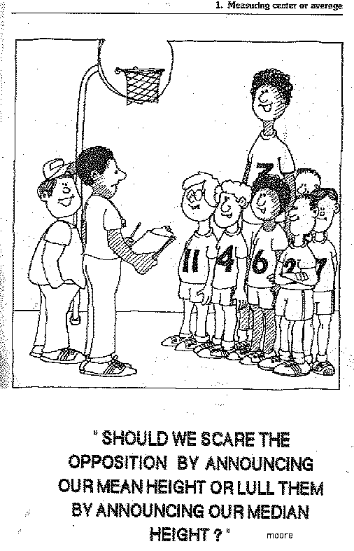

```{r setup, include=F}
knitr::opts_chunk$set(
  # comment = '',
  cache = FALSE,
  cache.lazy = FALSE,
  include = TRUE,
  message = FALSE, 
  warning = FALSE
)
```

```{r xaringan-themer, include = FALSE}
library(xaringanthemer)
# library(tidyverse)
style_mono_light(
  base_color = '#d95a19',
  header_font_google = google_font('Josefin Slab'),
  text_font_google = google_font('Raleway', '300', '300i')
)
```

<style>
hide {
  display: none;
}
.remark-slide-content h1 {
  font-size: 45px;
}
h1 {
  font-size: 2em;
  margin-block-start: 0.67em;
  margin-block-end: 0.67em;
}
.remark-slide-content {
  font-size: 16px
}
.remark-code {
  font-size: 14px;
}
code.r {
  font-size: 14px;
}
pre {
  margin-top: 0px;
  margin-bottom: 0px;
}
.footnote {
  color: #800020;
  font-size: 10px;
}
.aligncenter {
  text-align: center;
}
</style>

# Outline

--

- Distributions

--

- Descriptive Statistics

--

- Graphics

---

## Distributions

<!--
The distribution of a random variable X is a profile of its variability and other tendencies.
Depending on the type of X, a distribution is characterized by the following.
-->

--

Simple definition: a profile of a variable

--

+ Types of variables: **continuous** or **discrete**

--

  + **Discrete**: binary or **categorical**

--

    + **Categorical**: un-ordered or **ordinal**
--

      + **Ordinal**: Almost continuous, but assuming an underlying distribution (e.g. Poisson) often leads to poor deductions

--

+ Summarization techniques

  + [PDF and CDF](https://evamaerey.github.io/statistics/distributions.html#1)

--

  + [Moments (i.e. mean, variance, etc.)](https://evamaerey.github.io/statistics/covariance_correlation.html#14)

--

  + Quantiles (including median)

--

    + Proportionas fall under this category


---

## Distributions Aside

Mean or median?

<!--  -->

```{r echo=F, include=T, eval=T, out.width='30%', fig.align='center'}

```
---

## Distributions

--

Mean or median?

--

+ If there are extreme values -> median

--

+ If there are heavy-ties -> mean

--

+ If the assumed distribution is "well-behaved" -> mean

---

## Distributions

--

Limitation of Descriptive Statistics

+ Mean: outliers

+ Median: heavy ties

+ Standard deviations and variance: assymetric data
  
+ Range: outliers

+ Coefficient of variation: overly dependent on zero mean

---

## [Graphing](https://clauswilke.com/dataviz/)

Data as position or length

---

## Graphing

Horizontal length > vertical length


## Graphing

[Data-ink ratio](https://infovis-wiki.net/wiki/Data-Ink_Ratio))


---

## Graphing!!!]

Data-ink ratio


---

## Graphing

Color


---

## Graphing

Angles or slopes = not a great idea

---

## Graphing

Volumes = not a great idea


## Fin


