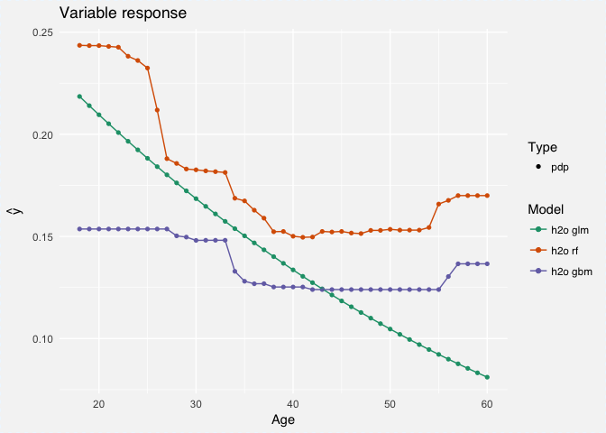

```{r setup, include=F}
knitr::opts_chunk$set(
  # comment = '',
  cache = FALSE,
  cache.lazy = FALSE,
  include = TRUE,
  message = FALSE, 
  warning = FALSE
)
```

```{r xaringan-themer, include = FALSE}
library(xaringanthemer)
# library(tidyverse)
style_mono_light(
  base_color = '#d95a19',
  header_font_google = google_font('Josefin Slab'),
  text_font_google = google_font('Raleway', '300', '300i')
)
```

<style>
hide {
  display: none;
}
.remark-slide-content h1 {
  font-size: 45px;
}
h1 {
  font-size: 2em;
  margin-block-start: 0.67em;
  margin-block-end: 0.67em;
}
//.remark-slide-content {
//  font-size: 16px
//}
.remark-code {
  font-size: 14px;
}
code.r {
  font-size: 14px;
}
pre {
  margin-top: 0px;
  margin-bottom: 0px;
}
.footnote {
  color: #800020;
  font-size: 10px;
}
.aligncenter {
  text-align: center;
}
</style>

# Outline

- Distributions

- Descriptive Statistics

- Graphics

- Tables

---

## Distributions

<!--
The distribution of a random variable X is a profile of its variability and other tendencies.
Depending on the type of X, a distribution is characterized by the following.
-->

--

Simple definition: a profile of a variable

--

+ Types of variables: **continuous** or **discrete**

--

  + **Discrete**: binary or **categorical**

    + **Categorical**: un-ordered or **ordinal**

      + **Ordinal**: Almost like continuous, but assuming an underlying distribution (e.g. Poisson) often leads to poor deductions

--

+ Summarization techniques

  + [PDF and CDF](https://evamaerey.github.io/statistics/distributions.html#1)

  + [Moments (i.e. mean, variance, etc.)](https://evamaerey.github.io/statistics/covariance_correlation.html#14)

  + Quantiles (including median)


---

## Distributions

--

Mean or median?

<!--  -->

```{r echo=F, include=T, eval=T, out.width='30%', fig.align='center'}
knitr::include_graphics('img/mean-or-median.png')
```
---

## Distributions


Mean or median?

--

+ If extreme values -> median

+ If heavy-ties -> mean

+ If the assumed distribution is "well-behaved" -> mean

---

## Distributions

--

Limitations of descriptive statistics

+ Mean: outliers

+ Median: heavy ties

+ Standard deviations and variance: asymmetric data
  
+ Range: outliers

+ Coefficient of variation: overly dependent on zero mean

---

## Graphing

--

+ Data as position or length

+ Perception of angles, slopes, and volumes

--

  + **[Pie charts](https://www.data-to-viz.com/caveat/pie.html)**: humans are bad at interpreting angles and [areas](https://www.data-to-viz.com/caveat/radius_or_area.html)
  
  + **[Radial](https://www.data-to-viz.com/caveat/circular_barplot_accordeon.html)** and **[circular](https://www.data-to-viz.com/caveat/circular_bar_yaxis.html)** barplots: see pie charts
  
  + **[Histograms](https://www.data-to-viz.com/caveat/bin_size.html)** and **density plots**: different bin sizes and kernel parameters can lead to different insights
  
  + **[Stacked bar charts](https://www.data-to-viz.com/caveat/stacking.html)**: make comparison difficult
  
  + **[Boxplots](https://www.data-to-viz.com/caveat/boxplot.html)**: can hide information

---

## Graphing

--

+ **[Horizontal length > vertical length](https://www.data-to-viz.com/caveat/hard_label.html)**: horizontal labels are easier to read

  + [Usually better if sorted](https://www.data-to-viz.com/caveat/order_data.html) [(but not always)](https://clauswilke.com/dataviz/visualizing_amounts_files/figure-html/income-by-age-sorted-1.png)


--

+ **[Data-ink ratio](https://www.data-to-viz.com/caveat/declutter.html)**: focus viewer's attention

--

+ **[Color](https://www.data-to-viz.com/caveat/color_com_nothing.html)**: should be meaningful

---

## Graphing

--

"Special" types of plots for models

--

+ **Partial effects plots**

  + Y ~ one X at a time
  
  + Great for showing effect of continuous predictors

--

+ **Effects charts**

  + Difference in means, odds ratio, etc.
  
  + Not great with continuous predictors
  
  + IQR typically used

--

+ **Nomograms**

  + Useful if number of interactions are relatively small

---

## Graphing

Partial effects

```{r echo=F, include=T, eval=T, out.width='70%', fig.align='center'}
knitr::include_graphics('img/partial-effects-example.jpg')
```

---

## Graphing

Partial effects

--

["Generalization"](https://stats.stackexchange.com/questions/371439/partial-effects-plots-vs-partial-dependence-plots-for-random-forests) is a partial dependency plot

```{r echo=F, include=T, eval=T, out.width='60%', fig.align='center'}

```

---

## Graphing

Effects

<!--Like an extension of partial effects plots, working on 2 variables instead of just 1.-->


```{r echo=F, include=T, eval=T, out.width='70%', fig.align='center'}
knitr::include_graphics('img/effects-example.jpg')
```

---

## Graphing

Nomogram


```{r echo=F, include=T, eval=T, out.width='60%', fig.align='center'}
knitr::include_graphics('img/nomogram-example.jpg')
```

---

## Tables

--

[Jon Schwabish's principles](https://themockup.blog/posts/2020-09-04-10-table-rules-in-r/)

```{r echo=F, include=T, eval=T, out.width='80%', fig.align='center'}
knitr::include_graphics('img/tables-v-charts.jpg')
```

---

## Tables

--

Recommendations for response variables

--

+ **Binary**

  + Show proportions
  
  + Only need to show 1 of the 2 proportions
  
  + Don't convert to percentages

--

+ **Continuous**

  + 3 quantiles + formatting to emphasize middle quantile
  
  + Include mean, median, etc.
  
--

<br />

Show confidence intervals where relevant

---

## References

Visualizations

+ https://www.data-to-viz.com/

+ https://clauswilke.com/dataviz/

+ [Tom Mock's summary of Jon Schwabish's principles](https://themockup.blog/posts/2020-09-04-10-table-rules-in-r/)
